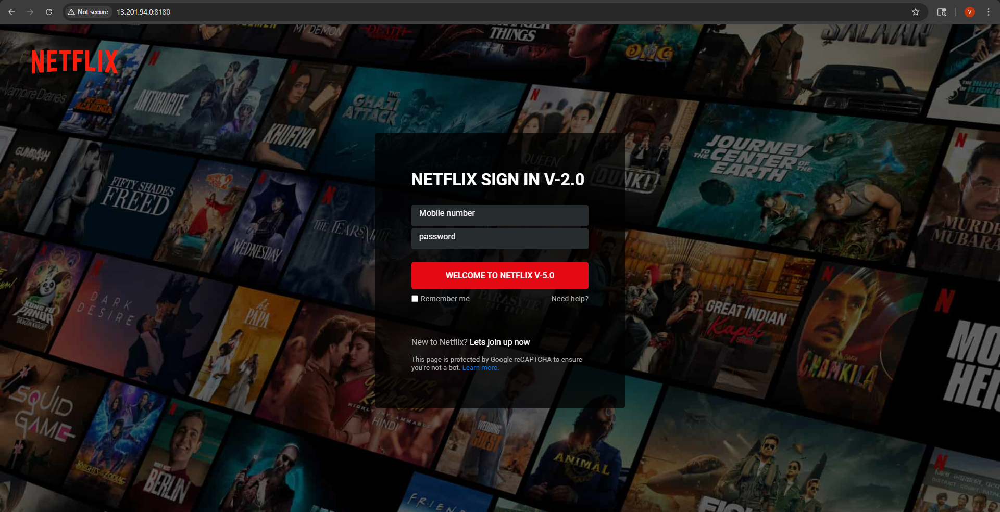

# Netflix-clone

## Pipeline Components

**Netflix Clone CI/CD Project** using Jenkins, Maven, and Apache Tomcat on AWS. 

---

### 🎯 **Project Architecture Overview**
The instructor explains a specific workflow:
1. **GitHub**: Stores the Java code and the `Jenkinsfile` (Pipeline script).
2. **Jenkins**: Triggers automatically via GitHub Webhook, builds the code using Maven to create a `.war` artifact.
3. **Apache Tomcat**: Acts as the Web/App Server where the Netflix clone is deployed.
4. **Prometheus & Grafana**: Mentioned for monitoring 

*(Note: Jenkins and Tomcat both use port **8080** by default. To avoid port conflict issues, the instructor uses **two separate AWS EC2 instances**).*
## Repository Structure

```bash
jenkins-docker-ci-cd/
├── images/
├── README.md
├── docker-hub.png
├── jenkins-pipeline.yml
├── netflix-clone.png
├── parameter.png
└── pipeline_stage_view.png
```

## CI/CD Workflow

1. Source code is prepared for pipeline execution.
2. Jenkins triggers the pipeline.
3. Pipeline parameters are used for controlled execution.
4. Docker image is built from the application.
5. Image is pushed to Docker Hub.
6. Pipeline stages are monitored in Jenkins Stage View.
7. Deployment output is validated visually.


---

### 🛠️ **Phase 1: AWS Infrastructure Setup**
1. **Launch 2 EC2 Instances (Ubuntu)**:
   * **Instance 1**: Name it `Jenkins` (Will host Jenkins).
   * **Instance 2**: Name it `Tomcat` (Will host Apache Tomcat).
   * *Specs*: 20GB Storage, `c7i.flex.large` (you can use `t2.micro` or `t3.medium` for free tier/practice).
2. **Change Hostnames (Optional but recommended for clarity)**:
   * On Instance 1: `sudo hostnamectl set-hostname jenkins`
   * On Instance 2: `sudo hostnamectl set-hostname tomcat`

---

### 🐱 **Phase 2: Tomcat Server Setup (On Instance 2)**
*The instructor uses an automated script from his GitHub for this, but here are the exact steps that script performs:*

1. **Connect to Tomcat Instance** and switch to root: `sudo su -`
2. **Update the system**: `apt update -y`
3. **Install Java** (Tomcat requires Java): 
   `apt install openjdk-17-jdk -y` *(Use Java 11 or 17 based on your Tomcat version)*
4. **Install Apache Tomcat** (Version 10/11):
   * Download Tomcat: `wget https://dlcdn.apache.org/tomcat/tomcat-10/v10.1.59/bin/apache-tomcat-10.1.59.tar.gz` *(Check apache.org for the latest link)*
   * Extract it: `tar -xvf apache-tomcat-10.1.x.tar.gz`
   * Rename for simplicity: `mv apache-tomcat-10.1.x tomcat`
5. **Configure Tomcat Users for Deployment**:
   * Open the config file: `nano tomcat/conf/tomcat-users.xml`
   * Add these lines just before `</tomcat-users>`
   OR replace all content with the following:
            ```xml
            <?xml version="1.0" encoding="UTF-8"?>
         <tomcat-users xmlns="http://tomcat.apache.org/xml"
                     xmlns:xsi="http://www.w3.org/2001/XMLSchema-instance"
                     xsi:schemaLocation="http://tomcat.apache.org/xml tomcat-users.xsd"
                     version="1.0">

         <!-- Roles for Manager App -->
         <role rolename="manager-gui"/>
         <role rolename="manager-script"/>
         
         <!-- Tomcat User credentials for Jenkins deployment and GUI login -->
         <user username="tomcat" password="vicky123" roles="manager-gui,manager-script"/>

         </tomcat-users>     ```
6. **Allow Remote Access to Tomcat Manager**:
   * Edit: `nano tomcat/webapps/manager/META-INF/context.xml`
   * Comment out the IP restriction (put `<!--` at the start and `-->` at the end of the `Valve` tag) so Jenkins can deploy remotely.
7. **Start Tomcat**: `tomcat/bin/startup.sh`
8. **AWS Security Group**: Go to AWS Console -> Tomcat Instance Security Group -> Inbound Rules -> **Add Rule** -> Port `8080` -> Source `Anywhere-IPv4`.
9. **Verify**: Open a browser and go to `http://<Tomcat-Instance-Public-IP>:8080`. Click "Manager App" and log in with `tomcat` / `vicky123`.

---

### ⚠️ CRITICAL STEP: Restart Tomcat!
If you do not restart Tomcat, the changes **will not take effect**

```bash
tomcat/bin/shutdown.sh
```
*(Wait 5 seconds for it to fully stop)*

```bash
tomcat/bin/startup.sh
```


<details>
<summary>access issue</summary>

The **403 Access Denied** error you are seeing on the Tomcat Manager App is extremely common. 

**Your username and password (`tomcat` / `vicky123`) are perfectly correct.** The issue is not your credentials; it is Tomcat's built-in security. 

By default, newer versions of Tomcat (Tomcat 9.0.30+, Tomcat 10, and Tomcat 11) **block remote access** to the Manager App. Since you are running Tomcat on an AWS EC2 instance and accessing it from your personal laptop's browser, Tomcat sees you as a "remote" user and blocks you.

Here is the exact, foolproof way to fix it right now via your SSH terminal.

---

### 🛠️ The Fix: Allow Remote Access

You need to edit the `context.xml` file inside the Manager app folder. 

**1. Open the file using nano:**
```bash
nano tomcat/webapps/manager/META-INF/context.xml
```

**2. Replace the entire content of the file:**
Delete whatever is currently there, and paste **exactly** this block of code:

```xml
<?xml version="1.0" encoding="UTF-8"?>
<Context antiResourceLocking="false" privileged="true" >
  <!--
  <Valve className="org.apache.catalina.valves.RemoteAddrValve"
         allow="127\.\d+\.\d+\.\d+|::1|0:0:0:0:0:0:0:1" />
  -->
</Context>
```
*(What this does: It completely comments out the `RemoteAddrValve` tag that was restricting access only to localhost).*

**3. Save and Exit:**
* Press `CTRL + O` (to save), then press `Enter`.
* Press `CTRL + X` (to exit nano).

---

### ⚠️ CRITICAL STEP: Restart Tomcat!
If you do not restart Tomcat, the XML changes **will not take effect**, and you will still get the 403 error. Run these commands exactly:

```bash
tomcat/bin/shutdown.sh
```
*(Wait 5 seconds for it to fully stop)*

```bash
tomcat/bin/startup.sh
```

---

</details>


### ⚙️ **Phase 3: Jenkins Server Setup (On Instance 1)**
**⚠️ CRITICAL TIP:** Do **NOT** use the "Long Term Support (LTS)" version of Jenkins right now. Use the **"Weekly Release"** version. The instructor faced plugin installation failures on LTS due to recent Java updates.

1. **Install Java**: `sudo apt install openjdk-17-jdk -y`
2. **Install Jenkins (Weekly Release)**: 
```
               sudo wget -O /etc/apt/keyrings/jenkins-keyring.asc \
               https://pkg.jenkins.io/debian-stable/jenkins.io-2026.key
               echo "deb [signed-by=/etc/apt/keyrings/jenkins-keyring.asc]" \
               https://pkg.jenkins.io/debian-stable binary/ | sudo tee \
               /etc/apt/sources.list.d/jenkins.list > /dev/null
               sudo apt update
               sudo apt install jenkins

               sudo wget -O /etc/apt/keyrings/jenkins-keyring.asc \
               https://pkg.jenkins.io/debian-stable/jenkins.io-2026.key
               echo "deb [signed-by=/etc/apt/keyrings/jenkins-keyring.asc]" \
               https://pkg.jenkins.io/debian-stable binary/ | sudo tee \
               /etc/apt/sources.list.d/jenkins.list > /dev/null
               sudo apt update
               sudo apt install jenkins

```
   * Follow the official Debian/Ubuntu instructions from **jenkins.io**, specifically selecting the weekly release repository.
   * Start Jenkins: `sudo systemctl start jenkins`
   * Check status: `sudo systemctl status jenkins`
3. **AWS Security Group**: Go to AWS Console -> Jenkins Instance Security Group -> Inbound Rules -> **Add Rule** -> Port `8080` -> Source `Anywhere-IPv4`.
4. **Unlock Jenkins**:
   * Go to `http://<Jenkins-Instance-Public-IP>:8080` in your browser.
   * Get the password from the server: `sudo cat /var/lib/jenkins/secrets/initialAdminPassword`
5. **Install Plugins**: Select **"Install suggested plugins"** and wait for it to finish. (Jenkins will restart automatically).


<details>
<summary>starting issue</summary>
 the Jenkins Weekly release has recently been updated, and **it now strictly requires Java 21 or Java 25**. Your error message is very clear: `Running with Java 17... which is older than the minimum required version (Java 21)`.

---

### 🛠️ The Fix: Upgrade to Java 21

Run these commands in your Jenkins EC2 terminal (Instance 1) one by one:

**1. Install Java 21:**
```bash
sudo apt update -y
sudo apt install openjdk-21-jdk -y
```

**2. Verify Java 21 is installed:**
```bash
java -version
```
*(You should now see `openjdk version "21.x.x"` instead of 17).*

**3. Tell Jenkins to specifically use Java 21:**
Even though Java 21 is installed, we need to explicitly point Jenkins to it so it doesn't get confused.
Open the Jenkins environment file:
```bash
sudo nano /etc/default/jenkins
```
Find the line that says `#JAVA_HOME=` (it might be empty or commented out). Change it to exactly this (uncommented):
```text
JAVA_HOME=/usr/lib/jvm/java-21-openjdk-amd64
```
*Save and exit (`CTRL+O`, `Enter`, `CTRL+X`).*

**4. Restart Jenkins to apply the changes:**
```bash
sudo systemctl daemon-reload
sudo systemctl restart jenkins
```

**5. Check if Jenkins is running successfully:**
```bash
sudo systemctl status jenkins
```
*(Look for the green **active (running)** text. The Java error will be completely gone).*

---

### ✅ Next Step
Once you see `active (running)`, go back to your browser:
👉 `http://<Jenkins-Instance-Public-IP>:8080`

You will now see the Jenkins Unlock screen! Get your password using:
```bash
sudo cat /var/lib/jenkins/secrets/initialAdminPassword
```

*(Note: For your Tomcat server on Instance 2, **keep it on Java 17**. Tomcat 10 runs perfectly on Java 17; only the absolute latest Jenkins Weekly requires Java 21).*
</details>

### 🛠️ Install docker in both 
<details>
<summary>docker installation</summary>
```bash
sudo apt-get update
sudo apt-get install ca-certificates curl
sudo install -m 0755 -d /etc/apt/keyrings
sudo curl -fsSL https://download.docker.com/linux/ubuntu/gpg -o /etc/apt/keyrings/docker.asc
sudo chmod a+r /etc/apt/keyrings/docker.asc

echo \
  "deb [arch=$(dpkg --print-architecture) signed-by=/etc/apt/keyrings/docker.asc] https://download.docker.com/linux/ubuntu \
  $(. /etc/os-release && echo "$VERSION_CODENAME") stable" | \
  sudo tee /etc/apt/sources.list.d/docker.list > /dev/null
sudo apt-get update
```

```bash
sudo apt-get install docker-ce docker-ce-cli containerd.io docker-buildx-plugin docker-compose-plugin
```
</details>
### After install
sudo apt install docker.io -y
sudo usermod -aG docker jenkins
---

### 🔗 **Phase 4: Jenkins Global Configuration**
Log in to Jenkins and set up the tools and connections:

1. **Configure Maven**:
   * Go to **Manage Jenkins** -> **Tools** -> Scroll to **Maven installations**.
   * Click "Add Maven", name it `Maven3`, select "Install automatically", and choose the latest version. Save it.
2. **Add Credentials** (Go to Manage Jenkins -> Credentials -> System -> Global credentials -> Add Credentials):
   * **GitHub Credential**: 
     * Kind: Username with password
     * Username: Your GitHub username
     * Password: Your GitHub password (or Personal Access Token)
     * ID: `github-creds`
   * **Tomcat Credential**:
     * Kind: Username with password
     * Username: `tomcat`
     * Password: `vicky123`
     * ID: `tomcat-creds`

---

### 🚀 **Phase 5: Creating the CI/CD Pipeline Job**
1. Go to Jenkins Dashboard -> **New Item**.
2. Name it (e.g., `netflix-pipeline`), select **Pipeline**, and click OK.
3. **General Tab**: Check **"GitHub hook trigger for GITScm polling"**. if repo is private
4. **Pipeline Tab**:
   * Definition: Select **"Pipeline script from SCM"**.
   * SCM: Select **Git**.
   * Repository URL: Paste your Java Netflix Clone GitHub repository link.
   * Branch: `*/main` (The instructor emphasizes changing `master` to `main`).
   * Script Path: `Jenkinsfile` (Assuming your repo has a Jenkinsfile).
5. **Save** the job.

---

### 🪝 **Phase 6: Setting up GitHub Webhook (For Auto-Trigger)**
This connects GitHub to Jenkins so that any code change automatically runs the pipeline.

1. Go to your **GitHub Repository** -> **Settings** -> **Webhooks** -> **Add webhook**.
2. **Payload URL**: `http://<Jenkins-Public-IP>:8080/github-webhook/` 
   *(Instructor warns: Do not forget the trailing slash `/`!)*
3. **Content type**: `application/json`
4. Click **Add webhook**. You should see a **green checkmark** ✅ next to it, meaning the connection is successful.

---

### 📝 **Phase 7: Writing the Deployment Step (Jenkinsfile)**
### 🔗 Update Jenkins Credentials
Go to Jenkins -> Manage Jenkins -> Credentials -> Add a new credential:
* **Kind:** SSH Username with private key
* **ID:** `ssh-target-creds`
* **Username:** `ubuntu`
* **Private Key:** Select "Enter directly", click "Add", and paste the contents of the private key file located at `/var/lib/jenkins/.ssh/id_rsa` on your Jenkins server.

---

The instructor uses Jenkins' **Snippet Generator** to easily write the Tomcat deployment code.


1. Open your `Jenkinsfile` in your GitHub repo (or edit it in Jenkins).
2. The instructor deletes any existing Docker/SSH steps to keep it simple.
3. **Generate Tomcat Deploy Script**:
   * In Jenkins, go to: `http://<Jenkins-IP>:8080/pipeline-syntax/`
   * Steps: Select **"Deploy to Container"** (This requires the "Deploy to Container" plugin, which was installed in Phase 3).
   * **Context**: Select `target/*.war` (Because Maven builds the `.war` file into the target folder).
   * **WAR file**: `netflix*.war` (or `*.war` depending on your project name).
   * **Container**: Select `Tomcat 9.x` (or your specific version).
   * **Credentials**: Select `tomcat-creds` (Created in Phase 4).
   * **Tomcat URL**: `http://<Tomcat-Instance-Public-IP>:8080`
   * Click **"Generate Pipeline Script"** and copy the groovy code.
4. Paste this generated code into a new `stage('Deploy')` block in your `Jenkinsfile`.

### ✨ **Final Step**
Commit the `Jenkinsfile` to GitHub. Because of the Webhook, Jenkins will automatically detect the change, pull the code, run Maven to build the `.war` file, and deploy it directly to your Tomcat server! You can then view your Netflix clone running at `http://<Tomcat-Public-IP>:8080/netflix`.

## Screenshots

### Parameterized Pipeline


### Jenkins Stage View


### Docker Hub Integration


### Application Output

