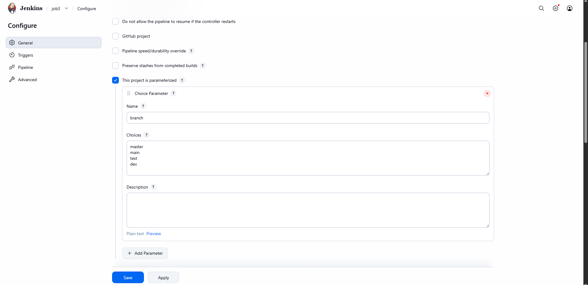
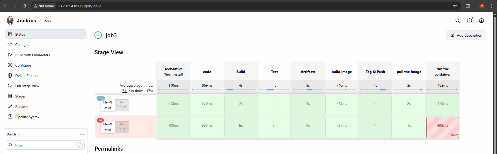
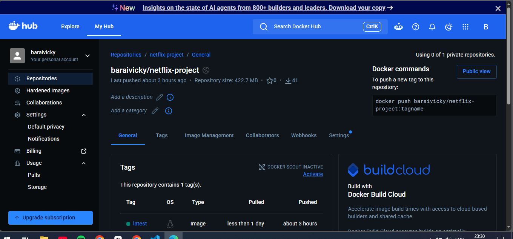
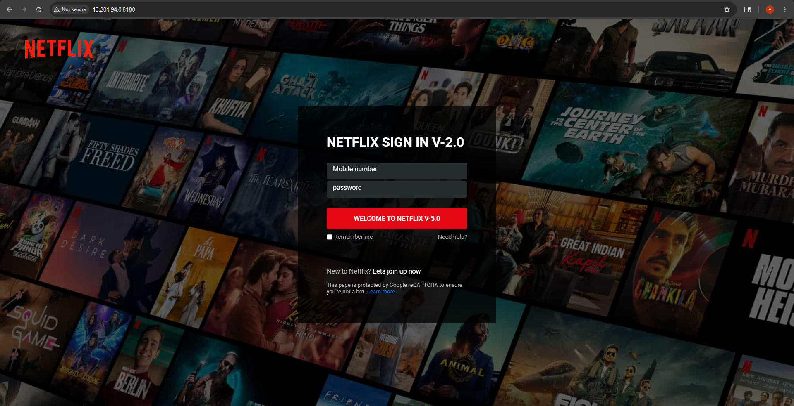

# Netflix-Clone CI/CD Project

**Netflix Clone CI/CD Project** using Jenkins, Maven, Docker, and AWS.

---

## 🎯 Project Architecture Overview

This project demonstrates a modern CI/CD pipeline that automates the build, test, and deployment of a Java-based Netflix Clone application.

1.  **GitHub**: Stores the source code, `Dockerfile`, and the `Jenkinsfile` (Pipeline script).
2.  **Jenkins (EC2 Instance 1)**: Triggers the pipeline automatically via GitHub Webhook, builds the application into a Docker image, and pushes it to Docker Hub.
3.  **Target Server (EC2 Instance 2)**: Receives the Docker image via SSH, stops the old container, and deploys the new version.
4.  **Docker Hub**: Acts as the registry to store the application images.

*(Note: We use two separate AWS EC2 instances to decouple the Jenkins server from the production environment and to avoid port conflicts.)*
<details>
<summary>**Headline: 🚀 Successfully Automated a Full CI/CD Pipeline for a Netflix Clone Application using Jenkins, Docker, and AWS!**
</summary>

I’m excited to share a comprehensive DevOps project I recently completed. I designed and implemented an end-to-end CI/CD pipeline to automate the build, test, and deployment of a Java-based Netflix Clone application.

**📌 Project Overview:**
The goal was to modernize the deployment process, moving from manual builds to a fully automated workflow that pushes a containerized application to a live AWS environment upon every code commit.

**🛠️ Tech Stack & Architecture:**
*   **Continuous Integration:** Jenkins (Pipeline as Code)
*   **Containerization:** Docker (Multi-stage builds using Maven)
*   **Cloud Infrastructure:** AWS EC2 (Ubuntu)
*   **Source Control:** GitHub (Webhook integration)
*   **Build Tool:** Maven
*   **Registry:** Docker Hub

**🔧 Key Features Implemented:**
1.  **Automated Triggers:** Configured GitHub Webhooks to trigger Jenkins pipelines automatically on push.
2.  **Multi-Stage Docker Builds:** Optimized Dockerfiles to compile Java code and package it into a WAR file within a builder stage, then deploy it to a Tomcat runtime stage.
3.  **Remote Deployment:** Used SSH Agents within Jenkins to securely communicate between the Jenkins server and the target production server, executing Docker run commands to restart containers without human intervention.
4.  **Zero-Downtime Deployments:** Implemented container cleanup strategies to stop and remove old containers before launching new instances, ensuring smooth updates.

**🧩 Challenges Overcome:**
The project wasn't without its hurdles! I tackled and resolved several critical issues:
*   **Java Compatibility:** Resolved strict Java version conflicts (Java 21 requirement for Jenkins Weekly vs. Java 17 for Tomcat) by configuring environment variables and updating tool configurations.
*   **Docker & SSH Scripting:** Debugged complex pipeline failures related to SSH key verification (`Host key verification failed`) and Docker port conflicts (`address already in use`), ensuring robust error handling in the Jenkinsfile.
*   **Pipeline Orchestration:** Debugged Heredoc syntax errors within SSH scripts to ensure clean pipeline execution.

**🚀 The Result:**
The outcome is a robust, scalable pipeline. A single push to the `main` branch now triggers a complete process:
*   Code Checkout → Docker Build → Push to Docker Hub → Remote Deployment → Container Restart.

I’ve gained deep hands-on experience in container orchestration, secure server communication, and automation workflow design.

I’m looking forward to applying these skills to more complex microservices architectures next!

**#DevOps #Jenkins #Docker #AWS #CI/CD #Automation #CloudComputing #Maven #Java #TechLearning**

## Screenshots

### Parameterized Pipeline


### Jenkins Stage View


### Docker Hub Integration


### Application Output


</details>

---

## Repository Structure

## CI/CD Workflow

1.  Source code is committed to the GitHub `main` branch.
2.  GitHub triggers the Jenkins Pipeline via Webhook.
3.  Jenkins pulls the code and builds a **Docker Image** using a multi-stage Maven build.
4.  Jenkins tags and pushes the image to **Docker Hub**.
5.  Jenkins uses **SSH** to connect to the Target Server.
6.  The Target Server pulls the new image and restarts the container.
7.  Application output is validated visually.

---

## 🛠️ Phase 1: AWS Infrastructure Setup

1.  **Launch 2 EC2 Instances (Ubuntu)**:
    *   **Instance 1**: Name it `Jenkins` (Will host Jenkins).
    *   **Instance 2**: Name it `Tomcat` (Will host the Application Container).
    *   *Specs*: 20GB Storage, `t2.medium` or `t3.medium` (Free tier `t2.micro` may run out of memory during Docker builds).
2.  **Change Hostnames (Optional but recommended for clarity)**:
    *   On Instance 1: `sudo hostnamectl set-hostname jenkins`
    *   On Instance 2: `sudo hostnamectl set-hostname tomcat`

---

## 🐳 Phase 2: Target Server Setup (On Instance 2)

*This server will run the Docker container. Since Tomcat is packaged inside the Docker image, we do not need to install Apache Tomcat manually on the OS.*

### 1. Install Docker
Connect to the Tomcat Instance and run:

<details>
<summary>Click to expand Docker installation commands</summary>

```bash
sudo apt-get update
sudo apt-get install ca-certificates curl
sudo install -m 0755 -d /etc/apt/keyrings
sudo curl -fsSL https://download.docker.com/linux/ubuntu/gpg -o /etc/apt/keyrings/docker.asc
sudo chmod a+r /etc/apt/keyrings/docker.asc

echo \
  "deb [arch=$(dpkg --print-architecture) signed-by=/etc/apt/keyrings/docker.asc] https://download.docker.com/linux/ubuntu \
  $(. /etc/os-release && echo "$VERSION_CODENAME") stable" | \
  sudo tee /etc/apt/sources.list.d/docker.list > /dev/null
sudo apt-get update
sudo apt-get install docker-ce docker-ce-cli containerd.io docker-buildx-plugin docker-compose-plugin
```

</details>

### 2. Post-Installation Steps
```bash
sudo usermod -aG docker ubuntu
```
*(Log out and log back in for this to take effect).*

### 3. Configure Security Group
Go to AWS Console -> Tomcat Instance Security Group -> Inbound Rules -> **Add Rule** -> Port `8080` -> Source `Anywhere-IPv4`.

---

## ⚙️ Phase 3: Jenkins Server Setup (On Instance 1)

### 1. Install Java 21 (Required for Jenkins Weekly)
**⚠️ CRITICAL TIP:** Do **NOT** use the "Long Term Support (LTS)" version of Jenkins right now. Use the **"Weekly Release"** version.

```bash
sudo apt update -y
sudo apt install openjdk-21-jdk -y
```
Verify: `java -version`

### 2. Install Jenkins
```bash
sudo wget -O /etc/apt/keyrings/jenkins-keyring.asc \
  https://pkg.jenkins.io/debian-stable/jenkins.io-2026.key
echo "deb [signed-by=/etc/apt/keyrings/jenkins-keyring.asc]" \
  https://pkg.jenkins.io/debian-stable binary/ | sudo tee \
  /etc/apt/sources.list.d/jenkins.list > /dev/null
sudo apt update
sudo apt install jenkins
```

### 3. Configure Jenkins to use Java 21
```bash
sudo nano /etc/default/jenkins
```
Add/Uncomment this line:
```text
JAVA_HOME=/usr/lib/jvm/java-21-openjdk-amd64
```
Save and restart:
```bash
sudo systemctl daemon-reload
sudo systemctl restart jenkins
```

### 4. Unlock Jenkins
Go to `http://<Jenkins-Instance-Public-IP>:8080` in your browser.
Get the password: `sudo cat /var/lib/jenkins/secrets/initialAdminPassword`

### 5. Install Plugins
Select **"Install suggested plugins"**.

---

<details>
<summary>Starting Issue: Java Version Error</summary>

If you see the error: `Running with Java 17... which is older than the minimum required version (Java 21)`

This means you tried to run the newer Jenkins Weekly release with Java 17.
**Solution:** Follow the steps in Phase 3, Section 1 to install Java 21 and configure `/etc/default/jenkins`.
</details>

---

## 🔗 Phase 4: Jenkins Global Configuration

### 1. Install Docker on Jenkins Server
Run the same Docker installation commands from Phase 2 on this Jenkins instance.

### 2. Add Credentials
Go to **Manage Jenkins** -> **Credentials** -> **System** -> **Global credentials** -> **Add Credentials**:

*   **GitHub Credential**:
    *   Kind: Username with password
    *   Username: Your GitHub username
    *   Password: Your GitHub **Personal Access Token** (Recommended) or Password.
    *   ID: `github-creds`
*   **Docker Hub Credential**:
    *   Kind: Username with password
    *   Username: Your Docker Hub username
    *   Password: Your Docker Hub Access Token.
    *   ID: `dockerhub`
*   **SSH Target Credential**:
    *   Kind: SSH Username with private key
    *   ID: `ssh-target-creds`
    *   Username: `ubuntu`
    *   Private Key: Enter the private key content (located at `/var/lib/jenkins/.ssh/id_rsa` on your Jenkins server).

---

## 🚀 Phase 5: Creating the CI/CD Pipeline Job

1.  Go to Jenkins Dashboard -> **New Item**.
2.  Name it `netflix-pipeline`, select **Pipeline**, and click OK.
3.  **General Tab**: Check **"GitHub hook trigger for GITScm polling"**.
4.  **Pipeline Tab**:
    *   Definition: Select **"Pipeline script from SCM"**.
    *   SCM: Select **Git**.
    *   Repository URL: `https://github.com/Vickybarai/Netflix-clone.git`
    *   Branch: `*/main`
    *   Script Path: `Jenkinsfile`
5.  **Save** the job.

---

## 🪝 Phase 6: Setting up GitHub Webhook

This connects GitHub to Jenkins so that any code change automatically runs the pipeline.

1.  Go to your **GitHub Repository** -> **Settings** -> **Webhooks** -> **Add webhook**.
2.  **Payload URL**: `http://<Jenkins-Public-IP>:8080/github-webhook/`
3.  **Content type**: `application/json`
4.  Click **Add webhook**. You should see a **green checkmark** ✅.

---

## 📝 Phase 7: Writing the Deployment Step (Jenkinsfile)

Since we are using Docker, we do not use the Tomcat "Deploy to Container" plugin. Instead, we use `sshagent` to run Docker commands on the remote server.

Here is the **final, working Jenkinsfile** content to place in your repo root:

```groovy
pipeline {
    agent any
    parameters {
        string(name: 'branch', defaultValue: 'main', description: 'Git branch')
    }
    environment {
        DOCKER_IMAGE = 'netflix1'
        DOCKER_REPO = 'baraivicky/netflix-project'
        DOCKER_TAG = 'latest'
        TARGET_IP = '3.238.79.115' // REPLACE WITH YOUR TARGET SERVER PRIVATE IP
        TARGET_USER = 'ubuntu'
        CONTAINER_NAME = 'netflix-app'
    }
    stages {
        stage('Git Checkout') {
            steps {
                git branch: "${params.branch}", credentialsId: 'github-creds', url: 'https://github.com/Vickybarai/Netflix-clone.git'
            }
        }
        stage('Build Docker Image') {
            steps {
                sh "docker build -t ${DOCKER_IMAGE} ."
            }
        }
        stage('Push to Docker Hub') {
            steps {
                withCredentials([usernamePassword(credentialsId: 'dockerhub', usernameVariable: 'DOCKER_USER', passwordVariable: 'DOCKER_PASS')]) {
                    sh """
                        echo ${DOCKER_PASS} | docker login -u ${DOCKER_USER} --password-stdin
                        docker tag ${DOCKER_IMAGE} ${DOCKER_REPO}:${DOCKER_TAG}
                        docker push ${DOCKER_REPO}:${DOCKER_TAG}
                    """
                }
            }
        }
        stage('Deploy to Target Server via SSH') {
            steps {
                sshagent(['ssh-target-creds']) {
                    sh """
                        ssh -o StrictHostKeyChecking=no ${TARGET_USER}@${TARGET_IP} << 'EOF'
                        docker stop ${CONTAINER_NAME} || true
                        docker rm ${CONTAINER_NAME} || true
                        docker ps -q -f "publish=8080" | xargs -r docker stop -t 0
                        docker ps -a -q -f "publish=8080" | xargs -r docker rm -f
                        docker pull ${DOCKER_REPO}:${DOCKER_TAG}
                        docker run -d --name ${CONTAINER_NAME} -p 8080:8080 ${DOCKER_REPO}:${DOCKER_TAG}
                        docker logs ${CONTAINER_NAME} --tail 10
EOF
                    """
                }
            }
        }
    }
    post {
        always {
            cleanWs()
        }
    }
}
```

---

## 🐛 Errors Encountered & Troubleshooting

This section details the common errors faced during this project and their solutions.

<details>
<summary>Error 1: Tomcat 403 Access Denied</summary>

**Problem:** `403 Access Denied` when trying to access the Tomcat Manager App.
**Cause:** Newer Tomcat versions block remote access to the Manager GUI by default.
**Solution:** Edit `tomcat/webapps/manager/META-INF/context.xml` on the target server and comment out the `<Valve className="...RemoteAddrValve" ... />` tag. Restart Tomcat.
</details>

<details>
<summary>Error 2: Maven `mvn: not found`</summary>

**Problem:** `Exit code 127: mvn: not found`.
**Cause:** Jenkins did not know where Maven was installed, or the `tools {}` block in the Jenkinsfile name didn't match the configuration in Jenkins UI.
**Solution:**
1.  Verify the `name` in Jenkins `Manage Jenkins -> Tools -> Maven installations` (e.g., `Maven3`).
2.  Ensure the Jenkinsfile uses the exact same name: `maven 'Maven3'`.
</details>

<details>
<summary>Error 3: Docker Build `lstat /target: no such file or directory`</summary>

**Problem:** Docker build fails looking for the `target` folder.
**Cause:** The `Dockerfile` used a wildcard `target/*.war` but the build context or exact filename was incorrect.
**Solution:**
1.  Ensure the `pom.xml` has `<packaging>war</packaging>`.
2.  Verify the exact WAR filename generated by Maven (check `pom.xml` `<artifactId>`).
3.  Update the `Dockerfile` COPY command to use the exact filename (e.g., `COPY --from=builder /app/target/NETFLIX-1.2.2.war /usr/local/tomcat/webapps/ROOT.war`).
</details>

<details>
<summary>Error 4: SSH `Host key verification failed`</summary>

**Problem:** `ERROR: script returned exit code 255` with `Host key verification failed`.
**Cause:** Jenkins hadn't verified the identity of the target server IP.
**Solution:** Add `-o StrictHostKeyChecking=no` to the `ssh` command in the Jenkinsfile, OR run `ssh-keyscan -H <TARGET_IP> >> ~/.ssh/known_hosts` on the Jenkins server as the `jenkins` user.
</details>

<details>
<summary>Error 5: Docker `address already in use`</summary>

**Problem:** `failed to bind host port 0.0.0.0:8080/tcp: address already in use`.
**Cause:** An old container or a different process was occupying port 8080.
**Solution:** Add cleanup steps in the Jenkinsfile to forcefully stop/remove any container using port 8080 before running the new one:
```bash
docker ps -q -f "publish=8080" | xargs -r docker stop -t 0
docker ps -a -q -f "publish=8080" | xargs -r docker rm -f
```
</details>

<details>
<summary>Error 6: Pipeline stuck at `Waiting for next available executor`</summary>

**Problem:** Pipeline triggers but never starts, stays "Pending".
**Cause:**
1.  Multiple old failed builds are clogging the executor queue.
2.  The Jenkins instance is out of RAM (Memory) and frozen.
**Solution:**
1.  Abort all stuck builds in the Jenkins console.
2.  Add Swap Space to the EC2 instance to increase available memory (e.g., `sudo fallocate -l 4G /swapfile && sudo chmod 600 /swapfile && sudo mkswap /swapfile && sudo swapon /swapfile`).
</details>

<details>
<summary>Error 7: Script Error `EOF: command not found`</summary>

**Problem:** `-bash: line 16: EOF: command not found`.
**Cause:** Indentation or whitespace before the closing `EOF` delimiter in the SSH heredoc.
**Solution:** Ensure the closing `EOF` is at the very beginning of the line with **no indentation**.
</details>

---

